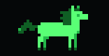

# Token Horse

A terminal pet for [Claude Code](https://code.claude.com) and [Codex CLI](https://developers.openai.com/codex/cli) — a tiny braille horse that gallops faster as your session burns more tokens per second.

[한국어 README](./README.ko.md)



## Install

```bash
npm install -g token-horse
```

Or try the demo without installing:

```bash
npx token-horse --rate=600 --duration=8
```

## Claude Code statusline

Add to your `settings.json`. The status line officially supports multi-line output, so the 4-row horse renders as-is.

```json
{
  "statusLine": {
    "type": "command",
    "command": "token-horse --statusline",
    "padding": 0,
    "refreshInterval": 1
  }
}
```

- `refreshInterval: 1` is recommended. By default the status line only re-runs on events (new responses, compaction), so the timer re-run is what lets the horse decelerate naturally while the session is idle.
- If your terminal does not render truecolor ANSI, add `--plain`.

```json
{
  "statusLine": {
    "type": "command",
    "command": "token-horse --statusline --plain",
    "padding": 0,
    "refreshInterval": 1
  }
}
```

## Codex CLI

Codex CLI's `tui.status_line` only accepts built-in widget identifiers and cannot run external commands. Instead, Token Horse tails the Codex session log (`~/.codex/sessions/**/rollout-*.jsonl`) and reads its `token_count` events. Run it in a separate terminal or tmux pane:

```bash
token-horse --watch-codex
```

- Automatically finds the most recent session file and follows new sessions as they start.
- Computes speed from the session-cumulative `total_token_usage.total_tokens` delta.
- Runs forever by default; stop with Ctrl+C or limit with `--duration=SECONDS`.
- Use `--codex-sessions=/path/to/sessions` if your session directory differs.

Example bottom tmux pane:

```bash
tmux split-window -v -l 5 'token-horse --watch-codex --no-clear'
```

## How it behaves

- Default L size: a 32-column × 8-row half-block frame — pixel-identical to the preview GIF. Pass `--size=s` for a compact 16×4 frame.
- The horse silhouette is drawn in three shades of green (truecolor ANSI) using solid block glyphs, so it stays crisp in any monospace font.
- In Claude Code, speed tracks **this session's real token consumption**: token-horse reads the session's `transcript_path` JSONL and measures the per-poll delta of billable tokens (input + output + cache-creation; cached-context reads are excluded). Transcripts are append-only, so context compaction and cache reuse never distort the speed.
- Speed is continuous, not stepped: ~20 tokens/sec trots, 900+ tokens/sec is a full gallop.
- When tokens stop flowing, the horse slows down and stops (exponential decay).
- Statusline mode reads stdin JSON once, prints one frame, and exits.
- Frame state lives in `~/.local/state/token-horse/` (or `$XDG_STATE_HOME`). State files are isolated per Claude Code `session_id`, so concurrent sessions never pollute each other's speed estimate. Stale session states are pruned after 48 hours.

## Input formats

Direct rate:

```json
{ "tokensPerSecond": 450 }
```

Cumulative tokens:

```json
{ "usage": { "total_tokens": 123456 } }
```

Claude Code statusline input — token-horse reads the `transcript_path` JSONL and sums each turn's billable tokens (`input + output + cache_creation`, excluding cached-context reads); the per-poll delta is the live tokens/sec:

```json
{
  "session_id": "abc123",
  "transcript_path": "~/.claude/projects/your-project/abc123.jsonl"
}
```

Codex session event line (what `--watch-codex` parses internally):

```json
{ "type": "event_msg", "payload": { "type": "token_count", "info": { "total_token_usage": { "total_tokens": 20987209 } } } }
```

When given cumulative tokens, tokens/sec is computed from the delta between calls.

## Development

```bash
npm run check   # syntax check + tests + OSS hygiene gate
npm run demo    # wave-pattern demo animation
```

## License

MIT © Ratelworks Inc.
